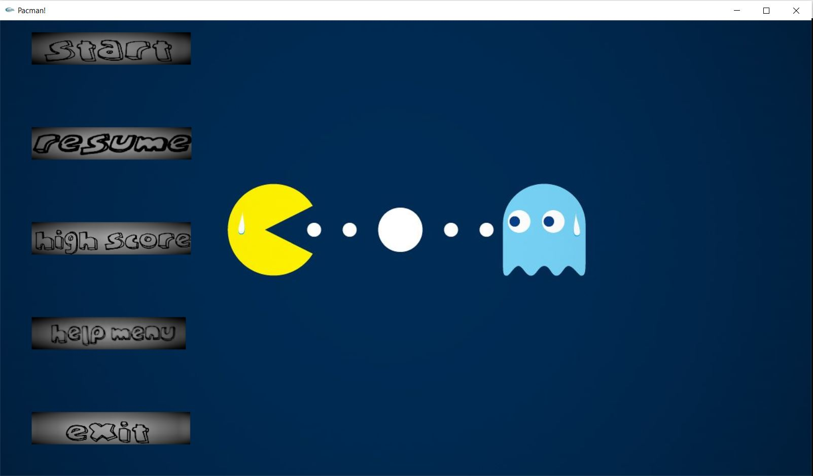
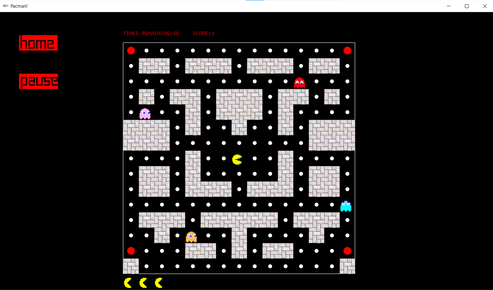
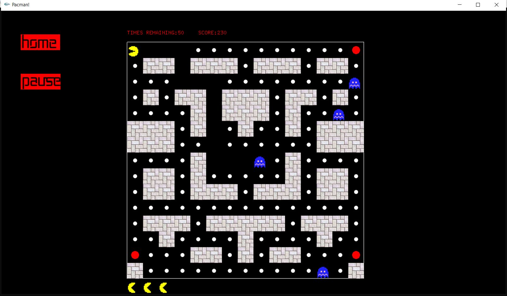
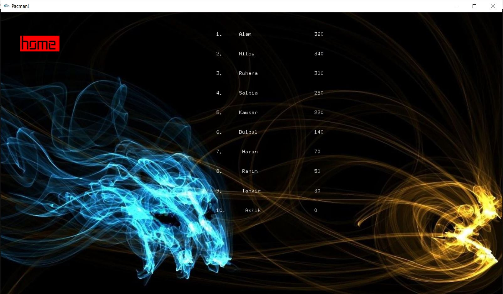
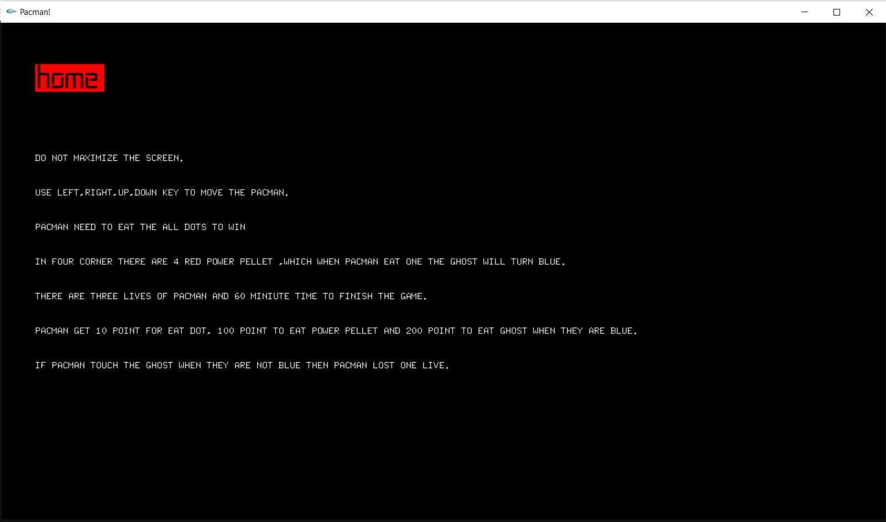
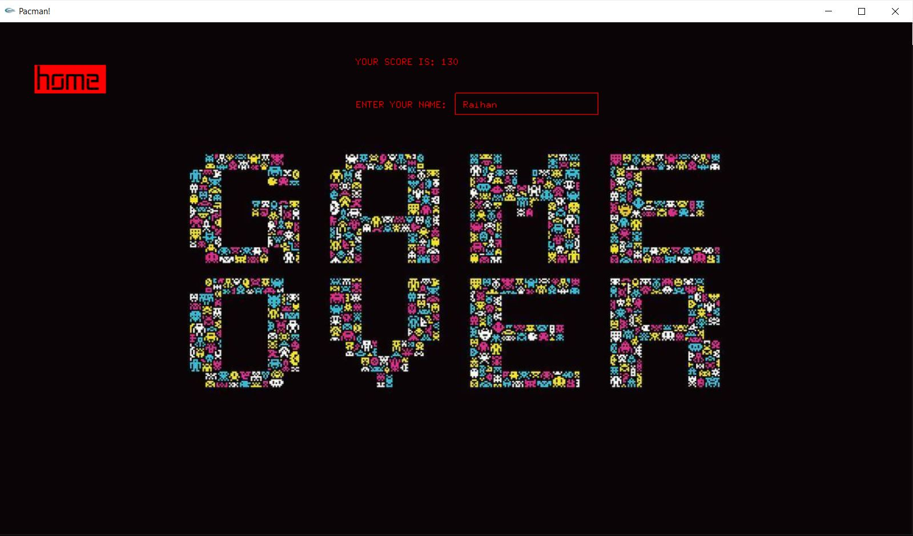
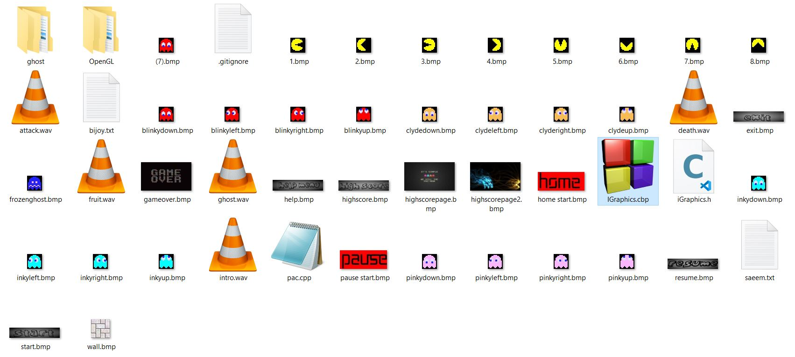
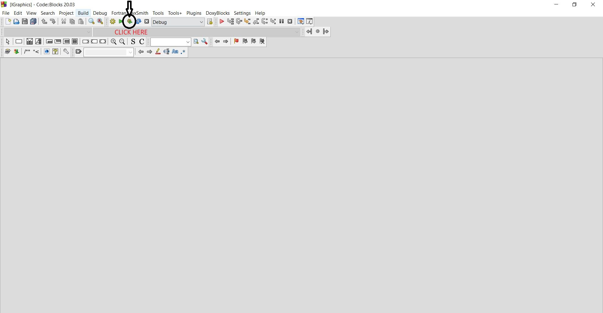

# Pacman 
>It is made by using igraphics library and C langulage.
---
## Feature Of the game
>HOME PAGE
>
>
>
>
>GAME
>
>Pacman is attacked by ghosts
>
>
>
>Now pacman can attack the ghosts
>
>
>
>HIGHSCORE PAGE
>
>
>
>HELP MENU
>
>
>
>GAME OVER PAGE
>
>

#### Getting the repository

1. Clone the repo
   ```sh
   git clone https://github.com/bijoy111/Term-project-for-1-1.git
   ```

2. If you don't have git installed in your device then download zip and then unzip it.


# HOW TO PLAY THE GAME

>Go to the IGraphics-master.
>Then click to the IGraphics.cbp(Open in the codeblocks)
>
>
>
>Then build and run the code
>
>
>
>Now play the game

# Where you will find the main code
>You will find the code in pac.cpp under IGraphics-master folder

# In case you face any problem
>Contact with me by email (bijoysaeem@gmail.com).
>Or you can google and get the solution.


